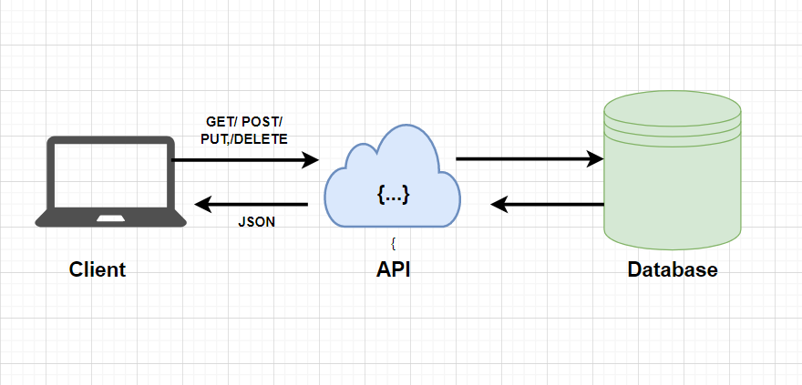

# DIGITAL BOOK APPLICATION BACKEND API

### Description

This is the backend component of the Digital Book Application. It is responsible for handling user authentication, managing book data, and providing an API for the frontend to interact with.
There are several challenges that I faced during building this such as using yup to validate form data and how to use multer specifically when the error occurs, it is necessary to make sure the files not uploaded.

## ARCHITECTURE DIAGRAM



## DATABASE MODEL (ERD)


## INSTALLATION

To use this application, you need to have the following:

- Node.js installed on your machine
- A database management system such as MySQL or PostgreSQL

To install the application, follow these steps:

- Clone the repository to your local machine: `git clone https://github.com/JAS145/Digital-Book-Application-FP.git`
- Install the dependencies: `npm install`
- Set up the database by running the SQL scripts located in the mySQL folder.
- Start the application: `npm start`

## API CONTRACT

## User

## User object

```
{
id integer,
role_id integer,
name string,
password string,
email string ,
username string,
address string,
join_date date,
phone_number string
}
```

## POST /user/register

Creates a new User.

- **Request**

  ```
    {
    "role_id": 2,
    "name": "xxxx",
    "password": "xxxx",
    "email": "xxxx@gmail.com",
    "username": "xxxx",
    "address": "xxxx",
    "join_date": "xxxx-xx-xx",
    "phone_number": "xxxx"
    }

  ```

- **Success Response**
  - **Code:** 200
  - **Content:**
    ```
    { payload :  data {
    isSuccess: result.affectedRows,
    id: result.insertId,
    },
    message : "Your account is successfully created"}
    ```
- **Error Response:**
  - **Code:** 400
  - **Content:**
  ```
  { payload : error.name, message : error.message }
  ```

## POST/user/login

Authenticate users

- **Request**

  ```
    {

    "email": "xxxx@gmail.com",
    "password": "xxxx",

    }

  ```

- **Success Response**

  - **Code:** 200
  - **Content:**

    ```
    { payload :  "token_secret",

    message : "Here is your token"}
    ```

- **Error Response:**
  - **Code:** 400
  - **Content:**
  ```
  { payload : error.name, message : error.message }
  ```

## PUT /user

Update user's data.

- **Request**

  ```
    {
    "role_id": 2,
    "name": "xxxx",
    "password": "xxxx",
    "email": "xxxx@gmail.com",
    "username": "xxxx",
    "address": "xxxx",
    "join_date": "xxxx-xx-xx",
    "phone_number": "xxxx"
    }

  ```

- **Success Response**
  - **Code:** 200
  - **Content:**
    ```
    { payload :  data {
    isSuccess: result.affectedRows,
    id: result.insertId,
    },
    message : "Your account is successfully updated}
    ```
- **Error Response:**
  - **Code:** 400
  - **Content:**
  ```
  { payload : error.name, message : error.message }
  ```

## DELETE /user/:id

Deletes the specified user.

- **Success Response:**
- **Code:** 200
  **Content:** {
  payload : data {result.affectedRows},
  message : "Your account has been deleted"
  }
  Error Response:
- **Code:** 404
- **Content:** {
  payload : "Error"
  message : "The account is not found" }
  OR
- **Code:** 400
- **Content:**
  ```
  { payload : error.name,
  message : error.message }
  ```
      OR
- **Code:** 401
- **Content:**
  ```
  { payload : "No Authentication Data Found",
  message : "Unauthorized." }
  ```

## Books

## Book object

```
{
user_id int not null,
  id integer,
  title string,
  author string,
  description string,
  publisher string,
  isbn string,
  publication_date string,
  category string,
  price integer,
  languages string,
  keywords string,
  image_url string,
  file_url string,
}
```

## POST /book

Creates a new Book.

- **Request**<br>
  Use req.body form data

- **Code:** 200
- **Content:**
  ```
  {
  payload : data {
  isSuccess : result.affectedRows,
  BookID : resutl.insertId
  },
  message : "Your new book has been successfully stored in the database"}
  ```
- **Error Responses:**

  - **Code:** 400
  - **Content:**

    ```
    {
    payload : error.name,
    message : error.message }
    ```

## GET /book

Returns all books in the system for users with publisher role.

- **Success Response:**
- **Code:** 200
- **Content:**
  ```
  {
  payload: [
  {<book_object>},
  {<book_object>},
  {<book_object>}
  ],
  message: "Here are your books"
  }
  ```
- **Error Response:**
  - **Code:** 404
  - **Content:**
    ```
    {
    payload : "Result is not found/undefined"
    message : "The book is not found" }
    ```
    OR
  - **Code:** 400
  - **Content:**
    ```
    {
    payload : error.name,
    message : error.message }
    ```

## GET /book/search

Returns related books or all books if the queary not applied.

- **Request** <br>
  Req.query.params
- **Success Response:**
- **Code:** 200
- **Content:**
  ```
  {
  payload: [
  {<book_object>}
  ],
  message: "Here is your book"
  }
  ```
- **Error Response:**
  - **Code:** 404
  - **Content:**
    ```
    {
    payload : "Result is undefined"
    message : "Your book is not found" }
    ```
    OR
  - **Code:** 400
  - **Content:**
    ```
    {
    payload : error.name,
    message : error.message }
    ```

## GET /book/:id

Returns the specified book.

- **Request** <br>
  Req.params.id
- **Success Response:**
- **Code:** 200
- **Content:**
  ```
  {
  payload: [
  {<book_object>},
  {<book_object>},
  {<book_object>}
  ],
  message: "Here is your book"
  }
  ```
- **Error Response:**
  - **Code:** 404
  - **Content:**
    ```
    {
    payload : "Result is undefined"
    message : "The book is not found" }
    ```
    OR
  - **Code:** 400
  - **Content:**
    ```
    {
    payload : error.name,
    message : error.message }
    ```

## PUT /book/:id

Updates fields on the specified book.

- **Request** <br>
  Use req.params.id and req.body form data

- **Success Response:**
- **Code:** 200
- **Content:**
  ```
  {
  payload : data{
  isSucces : result.affectedRows,
  message : result.message,
  },
  message : `The book with the ID = ${id} is updated`}
  ```
- **Error Response:**

  - **Code:** 404
  - **Content:**
    ```
    {
    payload : "Error updating book",
    message : `The book with the ID = ${id} is not found`}
    ```
    OR
  - **Code:** 400
  - **Content:**

    ```
    {
    payload : error.name,
    message : error.message }
    ```

## DELETE /book/:id

Deletes the specified book.

- **Request**<br>
  Req.params.id

- **Success Response:**
- **Code:** 200
- **Content:**
  ```
  {
  payload : data {isDeleted : result.affectedRows},
  message : `Your book with ID = ${id} has been deleted`
  }
  ```
- **Error Response:**
  - **Code:** 404
  - **Content:**
    ```
    {
    payload : error,
    message : `Your book with ID = ${id} is not found` }
    ```
    OR
  - **Code:** 400
  - **Content:**
    ```
    {
    payload : error.name,
    message : error.message }
    ```

## GET /book/image

Getting book's image.

- **Request** <br>
  Req.params.id
- **Success Response:**
- **Code:** 200
- **Content:**

  ```

    image.png/jpg/jpeg

  ```

- **Error Response:**
  - **Code:** 400
  - **Content:**
    ```
    {
    message : "Error getting book image"
    }
    ```

## POST /book/access

Input book's access data

- **Request** <br>

  ```
  {

  "book_id": integer,
  "user_id": integer,
  "payment_id":integer

  }
  ```

- **Success Response:**
- **Code:** 200
- **Content:**

  ```

  {
  payload : data {
  isSuccess : result.affectedRows,
  BookID : resutl.insertId
  },
  message : "The data sent successfully"
  }


  ```

- **Error Response:**

  - **Code:** 400
  - **Content:**

    ```
    {
    payload : error.name,
    message : error.message
    }
    ```

## GET /book/:bookId/read

Getting book's image.

- **Request** <br>
  Req.params.id
- **Success Response:**
- **Code:** 200
- **Content:**

  ```

    readStream file.pdf

  ```

- **Error Response:**
  - **Code:** 400
  - **Content:**
    ```
    {
    err
    }
    ```

## Ratings

## POST /rating

Creates a new rating.

- **Request**

  ```
    {
    "book_id": integer,
    "user_id": integer,
    "score": integer,
    "comment": string
    }

  ```

- **Success Response**
  - **Code:** 200
  - **Content:**
    ```
    { payload :  data {
    isSuccess: result.affectedRows,
    id: result.insertId,
    },
    message : "Your rating and comment have been successfully stored in the database"
    }
    ```
- **Error Response:**
  - **Code:** 400
  - **Content:**
  ```
  { payload : error.name, message : error.message }
  ```

## PUT /rating/:id

Update rating's data.

- **Request**

  ```
   {
    "book_id": integer,
    "user_id": integer,
    "score": integer,
    "comment": string
    }

  ```

- **Success Response**
  - **Code:** 200
  - **Content:**
    ```
    { payload :  data {
    isSuccess: result.affectedRows,
    id: result.insertId,
    },
    message : `The rating with the ID = ${id} is updated`
    }
    ```
- **Error Response:**
  - **Code:** 400
  - **Content:**
  ```
  { payload : error.name, message : error.message }
  ```

## DELETE /rating/:id

Deletes the specified rating.

- **Success Response:**
- **Code:** 200
  **Content:** {
  payload : data {result.affectedRows},
  message : "Your account has been deleted"
  }
  Error Response:
- **Code:** 404
- **Content:**
  ```
  {
  payload : "Error"
  message : `Your ratings with ID = ${id} has been deleted`
  }
  ```
  OR
- **Code:** 400
- **Content:**
  ```
  { payload : error.name,
  message : error.message }
  ```

## GET /rating

Returns all ratings of a book.

- **Request** <br>
  req.query.params
- **Success Response:**
- **Code:** 200
- **Content:**
  ```
  {
  payload: [
  {<book_object>},
  {<book_object>},
  {<book_object>}
  ],
  message: "Here are the book's ratings"
  }
  ```
- **Error Response:**
  - **Code:** 404
  - **Content:**
    ```
    {
    payload : "Result is not found/undefined"
    message : "The ratings are not found" }
    ```
    OR
  - **Code:** 400
  - **Content:**
    ```
    {
    payload : error.name,
    message : error.message }
    ```

## GET /rating/filter

Returns all ratings based on the filter.

- **Request** <br>
  req.query.params
- **Success Response:**
- **Code:** 200
- **Content:**
  ```
  {
  payload: [
  {<book_object>},
  {<book_object>},
  {<book_object>}
  ],
  message: "Here are the book's ratings"
  }
  ```
- **Error Response:**
  - **Code:** 404
  - **Content:**
    ```
    {
    payload : "Result is not found/undefined"
    message : "The ratings are not found" }
    ```
    OR
  - **Code:** 400
  - **Content:**
    ```
    {
    payload : error.name,
    message : error.message }
    ```

## GET /rating/:id

Returns all ratings of a book.

- **Request** <br>
  req.params.id
- **Success Response:**
- **Code:** 200
- **Content:**
  ```
  {
  payload: [
  {<book_object>}
  ],
  message: "Here are the book's ratings"
  }
  ```
- **Error Response:**
  - **Code:** 404
  - **Content:**
    ```
    {
    payload : "Result is not found/undefined"
    message : "The ratings are not found" }
    ```
    OR
  - **Code:** 400
  - **Content:**
    ```
    {
    payload : error.name,
    message : error.message }
    ```
